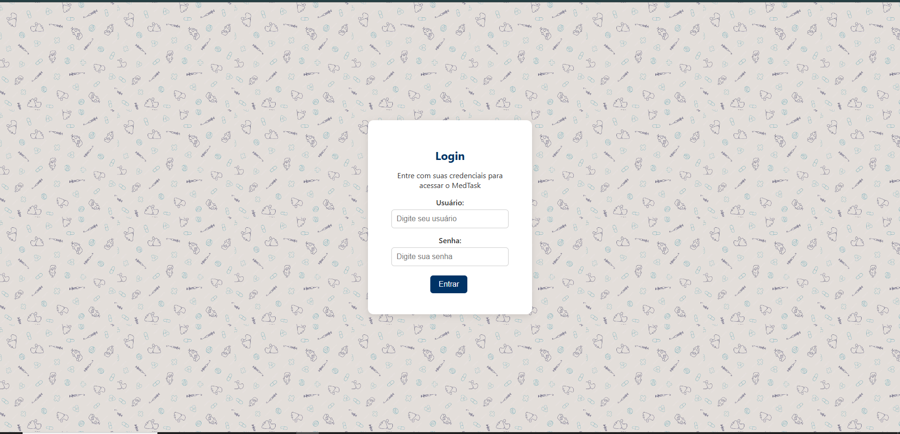
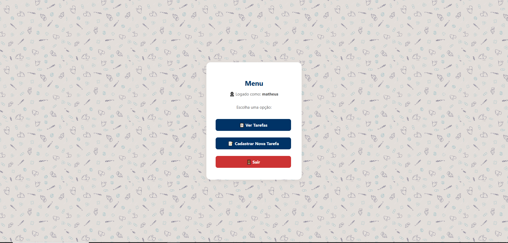
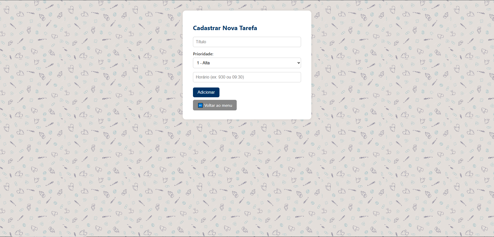

# 🚀 Nome do Projeto

**Projeto:** MEDTASK – Gerenciador de Tarefas com C, Python e SQLite

**Resumo:**  
O MedTask é um sistema de gerenciamento de tarefas que une tecnologias de back-end (C e Python/Flask) com front-end em HTML e CSS. Ele permite cadastro, listagem, edição e exclusão de tarefas de forma intuitiva, com persistência de dados em SQLite. A proposta surgiu como aplicação prática dos conceitos de estrutura de dados, programação em C e desenvolvimento web.

---

## 🎯 Objetivo

O projeto tem como objetivo desenvolver um sistema funcional que permita aos usuários gerenciar suas tarefas de forma eficiente. Ele se destaca por integrar um código C ao back-end da aplicação via Flask, proporcionando uma ponte entre tecnologias clássicas e modernas. A motivação é aplicar, na prática, os conteúdos das disciplinas de Estrutura de Dados e Programação Estruturada, além de promover uma introdução ao desenvolvimento web completo.

---

## 👨‍💻 Tecnologias Utilizadas

- Python 3.12 
- Flask
- SQLite 
- HTML + CSS 
- Linguagem C (main.c)
- VSCode

---

## 🗂️ Estrutura do Projeto

```
📦 Medtask
├── app.py                        # Script principal da aplicação Flask
├── criar_banco.py               # Geração e configuração inicial do banco de dados
├── tarefas.db                   # Banco de dados SQLite3
├── c_src/
│   └── main.c                   # Lógica auxiliar em C
├── static/
│   ├── imagem.jpeg
│   └── style.css                # Estilização da interface
├── templates/
│   ├── cadastrar.html
│   ├── editar.html
│   ├── listar.html
│   ├── login.html
│   ├── menu.html
│   └── tarefas.html             # Templates da interface web
└── .vscode/settings.json        # Configurações do editor VSCode
```

---

## ⚙️ Como Executar

### ✅ Rodando Localmente

1. Clone o repositório:

```
git clone https://github.com/Matheus686/projetomedtask.git
cd projetomedtask
```

2. Crie o ambiente virtual e ative:

```
python -m venv venv
venv\Scripts\activate
```

3. Instale as dependências:

```
pip install flask
```

4. Execute a aplicação:

```
python criar_banco.py
python app.py
```

---

## 📸 Demonstrações

- Tela de Login  
  

- Menu Principal com opções de navegação (Cadastrar nova tarefa, ver tarefas e Logout)  
  

- Tela de Cadastro de Tarefas  
  

- Listagem de tarefas com edição e remoção  
  

- Estilo visual leve com CSS e imagem ilustrativa

---

## 👥 Equipe

| Nome                              | GitHub                                          |
|-----------------------------------|--------------------------------------------------|
| Matheus Silva Soares             | [@Matheus](https://github.com/Matheus686) |
| Marcos Antônio Da Silva Souza    | [@Marcos](https://github.com/MacQueenDev)                                     |
| Miguel da Silva Perreira         | [@Miguel](https://github.com/MiguelPereira7)                                     |

---

## 🧠 Disciplinas Envolvidas

- Estrutura de Dados I
- Programação Estruturada em C
- Desenvolvimento Web

---

## 🏫 Informações Acadêmicas

- Universidade: Universidade Braz Cubas
- Curso: Ciência da Computação
- Semestre: Marcos e Miguel 2º / Matheus 3º
- Período: Noite
- Professora orientadora: Dra. Andréa Ono Sakai
- Evento: Mostra de Tecnologia 1º Semestre de 2025
- Local: Laboratório 12
- Datas: 05 e 06 de junho de 2025

---

## 📄 Licença

MIT License — sinta-se à vontade para utilizar, estudar e adaptar este projeto.

 © 2025 Matheus Silva, Marcos Oliveira, Miguel Andrade. Todos os direitos reservados.
